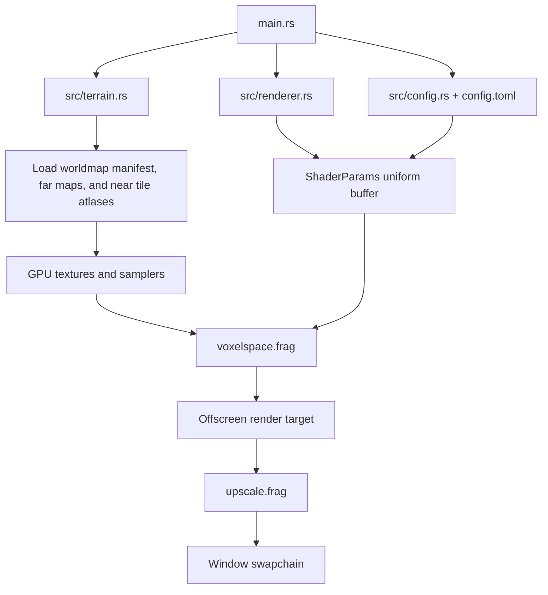

# Terrain Renderer

This document describes the current terrain renderer in `tungsten`. The renderer is VoxelSpace-inspired, but implemented as a full-screen GPU fragment shader that raycasts/raymarches a height field rather than drawing terrain columns on the CPU.

- Main loop and app orchestration: `src/main.rs`
- Runtime config parsing: `src/config.rs`
- Camera, replay, and player movement: `src/camera.rs`
- Render-pass orchestration: `src/renderer.rs`
- Terrain data, tile streaming, and collision height field: `src/terrain.rs`
- Terrain fragment shader: `shaders/voxelspace.frag`
- Upscale and overlay shader: `shaders/upscale.frag`
- Runtime settings: `config.toml`

## Data Flow



The app renders the terrain into an offscreen color target whose size is controlled by `performance_render_scale`. The result is then nearest-neighbor upscaled to the swapchain. The upscale pass also draws the FPS and frame-time overlay.

## Terrain Assets

The renderer loads a generated worldmap package selected by `config.toml`:

```toml
worldmap = "assets/worldmaps/continent/manifest.toml"
```

The package format is documented in [worldmaps.md](worldmaps.md). Runtime terrain data is split into always-resident far maps and a rolling near-tile cache.

| Purpose | Format | Default size | Runtime use |
| --- | --- | --- | --- |
| Near height tiles | Padded raw R16 tiles | `1028x1028` stored pixels per tile | Detailed close terrain, near DDA, CPU collision |
| Near color tiles | Padded raw RGBA8 tiles | `1028x1028` stored pixels per tile | Detailed color when the tile is resident |
| Far height map | Max-height raw R16 | `2048x2048` | Conservative far terrain LOD and backdrop |
| Far color overview | Downsampled raw RGBA8 | `4096x4096` | Color fallback for far or unloaded near terrain |

With `tile_cache_radius = 1`, the runtime keeps a `3x3` resident cache of near tiles. The default `1024` payload tiles are stored in `3072x3072` near height and near color atlas textures. Generated tile padding is still used while extracting payloads and for CPU collision data. After startup, moving across a tile boundary uploads the newly visible row or column into ring atlas slots while shared tiles stay resident.

The world width/depth and maximum height come from the manifest:

```text
world_width  = source_width  * horizontal_scale
world_depth  = source_height * horizontal_scale
max_height   = height_scale
```

For the current continent defaults this is:

```text
16384 * 0.5 = 8192 x 8192 world units
height_scale = 535.5 world units
```

The camera starts inside this world and `camera.max_distance` is initialized to the terrain diagonal, so rays can reach any map edge from inside the map.

## Coordinate System

The Rust camera stores horizontal position as `camera.x` and `camera.y`, plus vertical position as `camera.height`.

The shader works in `vec3` space as:

```text
shader x = world x
shader y = height
shader z = world y
```

That is why `camera_origin()` in the shader returns:

```glsl
vec3(camera.x, camera.z, camera.y)
```

The uniform field `camera` is packed as `[x, y, height, 0]`.

## Height Sampling

Height map sampling is nearest-cell sampling through `texelFetch`, not filtered texture sampling:

```glsl
float height_cell(sampler2D height_map, vec2 world_pos, vec2 map_size)
```

Far height sampling converts `world_pos / terrain.xy` into normalized terrain UVs, then into integer far-map cells.

Near height sampling first resolves the world position to:

```text
source cell -> resident source-cell window -> ring atlas cell
```

The shader checks whether the source cell is inside the resident near window before using a near tile. Ring atlas coordinates are computed from the resident window origin and an atlas-origin uniform, avoiding integer division in the hot path. If the source cell is outside the resident window, the far height map is used instead.

Color sampling follows the same resident-window check. Resident near color comes from the near color atlas. Distant color falls back to the far color overview.

## Height LOD

The shader blends between the near and far height maps based on horizontal distance from the camera:

```glsl
float height_lod_blend(float horizontal_dist) {
    return smoothstep(lod_distances.x, lod_distances.y, horizontal_dist);
}
```

Those two distances come from:

- `height_lod_blend_start`
- `height_lod_blend_end`

Behavior:

- Before `height_lod_blend_start`, terrain height comes from the resident near height tile when available.
- After `height_lod_blend_end`, terrain height comes from the far max-height map.
- Between them, the shader linearly mixes near and far heights using a smoothstep blend.
- If the requested near tile is not resident, the shader uses the far max-height map immediately.

The far map is a max-height mip. That means each far texel stores the maximum source height over the area it represents, rather than an average. This is conservative for distant terrain: peaks and ridges are less likely to disappear between coarse samples.

## Distance Detail Diagram

The renderer has several detail systems that change with horizontal distance from the camera. They are layered rather than one single fixed sequence: the near DDA range, height-map LOD blend, normal-lighting fade, raymarch budget, and far backdrop can overlap depending on `config.toml`.

```text
Horizontal distance from camera

0                                                                                  map edge
|---------------------------------------------------------------------------------------->

HEIGHT SOURCE
|-- resident near tile --|==== smooth blend ====|-- 2k max-height far map --------------->
                         ^                      ^
                         |                      |
              height_lod_blend_start  height_lod_blend_end

RAY / HIT METHOD
|-- resident-tile DDA --|-- main distance-scaled raymarch -------------|-- 2D backdrop -->
                   ^                                                    ^
                   |                                                    |
          near_dda_distance                           ray_iteration_count exhausted

STEP / GEOMETRY DETAIL
|-- smallest / most stable steps --|-- growing steps --|-- coarse far backdrop samples -->

LIGHTING DETAIL
|-- sampled terrain normals ----------------|==== fade ====|-- flat far terrain light --->
                                            ^              ^
                                            |              |
                              normal_detail_blend_start  normal_detail_blend_end

COLOR
|-- resident near color tiles when available --|-- far color overview fallback ----------->
```

Typical interpretation:

- Close terrain gets resident detailed height/color tiles and the near-cell DDA path.
- Mid-distance terrain uses the main raymarch with growing steps and a near-to-far height blend.
- Distant raymarched terrain uses the far max-height map and gradually loses detailed normal lighting.
- If the main raymarch runs out of iterations before reaching the map edge, the 2D backdrop can fill in farther silhouettes from the far map.

## Rendering Stages

For each screen pixel, the terrain shader constructs a camera ray and tries to find where it intersects the height field.

```text
pixel -> camera ray
      -> terrain AABB clipping
      -> near detailed DDA
      -> distance-scaled raymarch
      -> optional far 2D backdrop
      -> terrain color + lighting + fog, or sky
```

### 1. Terrain Bounds Clipping

Before doing terrain work, the shader clips the ray against the terrain axis-aligned bounding box:

```text
x: 0 .. terrain width
y: 0 .. height_scale
z: 0 .. terrain depth
```

If the ray never enters this box, the pixel is sky.

This prevents upward-looking rays from burning the full raymarch budget.

### 2. Near DDA

The first part of the ray uses a grid traversal over resident near height cells:

```glsl
raycast_near_height_cells(...)
```

This is a 2D DDA through height-map cells. It steps cell boundary to cell boundary across resident detailed tiles and tests whether the ray crosses the height value in each cell. It is meant to make very close terrain stable and detailed without relying on many tiny generic raymarch steps. If the traversal leaves the resident near window, it exits and lets the main raymarch continue with normal far/LOD sampling.

Controlled by:

- `near_dda_distance`
- `near_dda_max_steps`

The DDA only runs out to `near_dda_distance` in horizontal world units. After that, the main raymarch takes over.

`near_dda_max_steps` is a separate safety and performance cap on how many height-map cells the DDA may traverse for a single ray. Each step advances to the next source-cell boundary along X and/or Z, samples the next resident near-height cell, and checks whether the ray crossed the cell height. If this step limit is reached before `near_dda_distance`, the DDA exits at its current ray distance and the main raymarch resumes from there.

In practice:

- Higher values let shallow or diagonal rays keep using exact close-cell traversal for longer.
- Lower values reduce worst-case foreground cost, especially at low camera angles.
- Too-low values can make the main raymarch take over early, which can reintroduce close terrain popping or missed small features even when `near_dda_distance` is large.

### 3. Main Raymarch

The main terrain pass uses a distance-scaled step size:

```glsl
float raymarch_step_size(float horizontal_dist, float lod_blend)
```

The step grows with distance and also blends between near and far behavior using the height LOD blend. This is the main performance mechanism for covering longer distances without a fixed tiny step everywhere.

The raymarch is capped by:

- `ray_iteration_count`
- `MAX_RAY_ITERATIONS`, currently `4096`
- `camera.max_distance`
- the terrain AABB exit distance

If a step crosses from above terrain to below terrain, the shader refines the hit using binary search. Refinement steps are distance-scaled:

| Range | Refinement steps |
| --- | --- |
| Near | `6` |
| Mid | `5` |
| Far | `4` |

The shader also probes inside large steps at one-third and two-thirds of the interval when the step is large and the previous ray/terrain distance is close enough. This helps reduce missed ridges without fully returning to tiny steps.

### 4. Far 2D Backdrop

If the main raymarch does not hit terrain because the iteration budget ran out, the shader can still render distant terrain using a cheaper far-height-map raycast:

```glsl
raycast_backdrop(...)
```

This backdrop pass:

- starts where the main raymarch stopped,
- uses only the far 2048 max-height map,
- walks forward in horizontal distance,
- grows step size with distance,
- shades hits through the same normal-detail lighting blend as raymarched terrain.

This is meant to fill in distant scenery beyond the expensive 3D raymarch budget. It is not as precise as the main raymarch, but it is cheaper and uses the conservative max-height far map.

Because the far map stores conservative max heights, the first backdrop hit can be visibly higher than the last raymarched terrain when `ray_iteration_count` is low. To reduce that visible wall on weaker hardware profiles, the backdrop raycast subtracts a small world-height-relative offset from the far height map before testing for hits. This only affects the 2D backdrop; the main raymarch still uses the unmodified height data.

Current backdrop shader constants:

| Constant | Value | Meaning |
| --- | ---: | --- |
| `BACKDROP_MAX_STEPS` | `256` | Maximum far backdrop samples |
| `BACKDROP_MIN_HORIZONTAL_STEP` | `0.5` | Minimum horizontal backdrop step |
| `BACKDROP_MAX_HORIZONTAL_STEP` | `8.0` | Maximum horizontal backdrop step |
| `BACKDROP_HIT_BIAS` | `2.0` | Allows near misses to count as hits |
| `BACKDROP_START_BIAS` | `2.0` | Starts backdrop slightly beyond the raymarch stop |
| `BACKDROP_HEIGHT_OFFSET_FRACTION` | `0.005` | Fraction of `height_scale` subtracted from backdrop height samples |

## Lighting, Normals, and Fog

Terrain color starts with the color map:

```glsl
vec3 base = color_at(world_pos);
```

Near/mid terrain computes a terrain normal from four neighboring height samples and applies a simple directional light:

```glsl
terrain_light(terrain_normal(world_pos, lod_blend))
```

Far terrain and backdrop terrain gradually blend toward a constant light level:

```glsl
FAR_TERRAIN_LIGHT = 0.84
```

The blend range is configured with:

- `normal_detail_blend_start`
- `normal_detail_blend_end`

The 2D backdrop uses the same lighting function. If a backdrop hit is before `normal_detail_blend_start`, it uses sampled terrain normals; through the blend range it mixes toward flat light; beyond `normal_detail_blend_end`, it uses `FAR_TERRAIN_LIGHT`.

Fog mixes terrain color toward sky based on horizontal hit distance and `camera.max_distance`.

## Runtime Config

Runtime settings live in `config.toml`. The parser is intentionally flat: tables are not supported, and each key is written as `key = value`.

Missing keys use built-in defaults from `src/config.rs`.

| Key | Default | Valid range / values | Effect |
| --- | ---: | --- | --- |
| `worldmap` | `"assets/worldmaps/continent/manifest.toml"` | non-empty path | Generated worldmap manifest to load. |
| `tile_cache_radius` | `1` | `1..2` | Radius of the resident near-tile cache. `1` means `3x3` tiles; `2` means `5x5`. |
| `ray_iteration_count` | `700` | `1..4096` | Main raymarch iteration budget. If it runs out, the far backdrop may take over. |
| `performance_render_scale` | `0.5` | `> 0.0` and `<= 1.0` | Multiplies the window size for the offscreen terrain render target. Lower is faster and more pixelated. |
| `present_mode` | `"vsync"` | `"vsync"`, `"immediate"`, `"mailbox"` | SDL GPU swapchain present mode. |
| `max_framerate` | `0.0` | `>= 0.0` | CPU-side framerate cap. `0.0` means unlimited. |
| `render_debug_visuals` | `false` | `true` or `false` | Enables cycling terrain debug views with `F3`. |
| `near_dda_distance` | `512.0` | `> 0.0` | Horizontal distance covered by near detailed DDA before main raymarching. |
| `near_dda_max_steps` | `1024` | `1..4096` | Maximum resident near-height cells the DDA may traverse before handing off to the main raymarch. |
| `start_x` | `250.0` | `>= 0.0` | Initial camera/player X coordinate. |
| `start_y` | `330.0` | `>= 0.0` | Initial camera/player Y coordinate, mapped to shader Z. |
| `start_height` | `150.0` | `>= 0.0` | Initial camera/player height. |
| `height_lod_blend_start` | `125.0` | non-negative, less than end | Distance where height starts blending from near to far map. |
| `height_lod_blend_end` | `300.0` | non-negative, greater than start | Distance where height is fully far-map based. |
| `normal_detail_blend_start` | `500.0` | non-negative, less than end | Distance where detailed normal lighting starts fading out. |
| `normal_detail_blend_end` | `1000.0` | non-negative, greater than start | Distance where lighting is fully flat far light. |

### Present Mode Notes

`present_mode` affects frame pacing and benchmarking:

- `"vsync"`: display-paced. Usually caps at the monitor refresh rate.
- `"immediate"`: presents as soon as possible. Useful for raw throughput tests, but can tear.
- `"mailbox"`: keeps the latest completed frame for the next refresh where supported. Lower latency than vsync without classic tearing, but may render dropped frames.

`max_framerate` is a CPU-side sleep at the end of each frame. It cannot make rendering faster than vsync or driver pacing, but it can cap uncapped modes.

### Debug Visuals

When `render_debug_visuals = true`, pressing `F3` cycles through four modes:

```text
No debug visuals
-> Height source colors
-> Ray / hit method colors
-> Normal lighting mode colors
-> No debug visuals
```

Height source colors:

| Color | Meaning |
| --- | --- |
| Blue | Resident near height tile |
| Purple | Smooth blend between resident near height and far height |
| Orange | Far max-height map |
| Red/orange | Far 2D backdrop |

Ray / hit method colors:

| Color | Meaning |
| --- | --- |
| Green | Resident near-tile DDA hit |
| Cyan | Main distance-scaled raymarch hit |
| Yellow | Large-step probe hit |
| Magenta | Far 2D backdrop hit |

Normal lighting colors:

| Color | Meaning |
| --- | --- |
| Green | Detailed sampled terrain normals |
| Yellow | Blending from detailed normals to flat far light |
| Red | Flat far terrain light |

## Collision and Gravity Mode

CPU-side terrain collision uses the resident near height tile cache through `HeightField`. The CPU samples raw R16 tile data with bilinear filtering and scales it with the manifest `height_scale`.

Gravity/player mode uses this CPU height field to:

- keep the player above terrain,
- apply gravity and jumping,
- clamp horizontal movement inside the terrain world.

The shader and the CPU collision system share the same resident detailed near height tiles. The shader samples them with nearest texel fetch while CPU collision uses bilinear interpolation. Tiles use ring atlas slots, so crossing a tile boundary uploads only the newly visible row or column instead of reshuffling the full atlas.

## Asset Generation Tools

The repo includes helper binaries for derived assets:

| Tool | Purpose |
| --- | --- |
| `build_worldmap` | Generate tiled worldmap packages from source height/color maps. |
| `max_height_mip` | Generate conservative max-height R16 mips for far terrain. |
| `upsample_heightmap` | Generate bilinear interpolated R16 height maps. |
| `upsample_colormap` | Generate bilinear upsampled, ordered-dithered PNG color maps. |

The far height map used by the renderer should be generated as a max-height mip, not an average mip, so distant peaks remain visible.

## Practical Tuning Order

For performance and quality tuning, useful order is:

1. Set `present_mode = "immediate"` and `max_framerate = 0.0` to measure raw throughput.
2. Tune `performance_render_scale` for pixel cost.
3. Tune `ray_iteration_count` for main raymarch range.
4. Tune `near_dda_distance` and `near_dda_max_steps` for close-detail stability.
5. Tune `height_lod_blend_start/end` to hide the near/far height transition.
6. Tune `normal_detail_blend_start/end` to reduce expensive normal sampling in the distance.
7. Use `max_framerate` and `present_mode` for final pacing.
